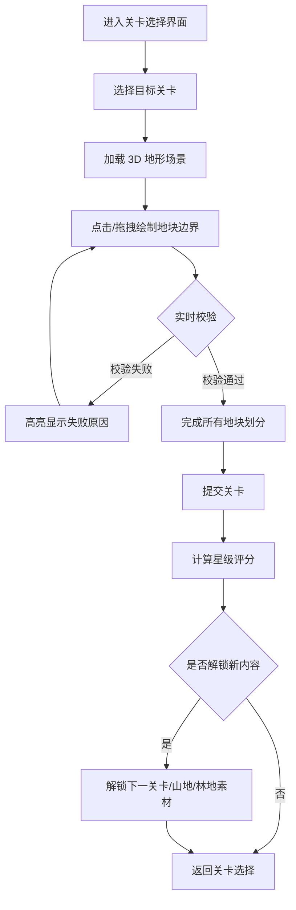

## 1. 产品概述

面向测绘行业新人的 3D 交互训练游戏，通过在三维地形画布上拖拽边界线条划分采集区块，掌握规范的地块划分技能。学员在关卡约束下完成地块划分（面积限制、水系避让、闭合要求），逐步解锁山地、林地等特殊地形素材，最终具备独立完成野外测绘地块划分的能力。

## 2. 核心功能

### 2.1 用户角色

| 角色 | 注册方式 | 核心权限 |
|------|----------|----------|
| 测绘学员 | 无需注册，直接使用 | 进行关卡训练、查看成绩、解锁素材 |

### 2.2 功能模块

1. **关卡选择界面**：关卡列表、进度展示、解锁状态、难度标识
2. **3D 测绘主场景**：三维地形画布、边界绘制工具、校验状态面板
3. **关卡校验系统**：面积校验、水系穿越校验、闭合校验、边界重叠校验
4. **素材解锁系统**：完成关卡解锁山地/林地特殊地形
5. **成绩与进度系统**：分数计算、星级评价、进度存档

### 2.3 页面详情

| 页面名称 | 模块名称 | 功能描述 |
|----------|----------|----------|
| 关卡选择界面 | 关卡卡片 | 显示关卡名称、难度、地形类型、解锁状态、已得星级 |
| 关卡选择界面 | 进度总览 | 总关卡数、已完成数、解锁素材数量 |
| 3D 测绘主场景 | 三维地形画布 | 可旋转、缩放、平移的 3D 地形展示，包含水系、高程变化 |
| 3D 测绘主场景 | 边界绘制工具 | 点击添加顶点、拖拽移动顶点、闭合多边形、删除顶点 |
| 3D 测绘主场景 | 实时校验面板 | 显示当前面积、校验状态（通过/失败）、失败原因高亮 |
| 3D 测绘主场景 | 关卡约束信息 | 显示本关最大面积限制、水系位置、目标地块数量 |
| 3D 测绘主场景 | 视角控制 | 3D 旋转、俯视切换、地形细节放大 |
| 校验结果弹窗 | 结果展示 | 星级评分、各校验项通过情况、解锁提示 |

## 3. 核心流程

用户进入关卡选择界面，选择已解锁的关卡，进入 3D 测绘场景。在三维地形上通过点击添加边界顶点，拖拽调整顶点位置，绘制闭合的地块多边形。系统实时校验地块的面积、边界是否穿越水系、是否完整闭合、是否与其他地块重叠。所有校验通过后提交关卡，获得星级评分并解锁下一关卡或特殊地形素材。

## 4. 用户界面设计

### 4.1 设计风格

- **主色调**：深墨绿 `#1a3a2a` 作为主色，搭配土黄 `#c9a96a` 作为强调色，营造专业测绘的大地质感
- **辅助色**：水系蓝 `#3a7ca5`、校验失败红 `#c94a4a`、校验通过绿 `#4ac97a`
- **按钮风格**：圆角矩形按钮，带轻微立体感，悬停时有微抬升效果
- **字体**：标题使用 "Noto Serif SC" 宋体风格，正文使用 "Noto Sans SC" 无衬线体
- **布局风格**：沉浸式 3D 场景为核心，UI 面板采用半透明毛玻璃效果浮于场景之上
- **图标风格**：线性简约图标，配合测绘专业元素（三角板、量角器、标尺等）

### 4.2 页面设计概览

| 页面名称 | 模块名称 | UI 元素 |
|----------|----------|----------|
| 关卡选择界面 | 关卡卡片 | 网格布局，卡片带地形缩略图、星级图标、锁定遮罩、渐变边框 |
| 3D 测绘主场景 | 三维地形画布 | 全屏 3D 场景，带雾化效果、动态光照、地形纹理 |
| 3D 测绘主场景 | 工具面板 | 左侧竖向工具栏，半透明深色背景，图标+文字按钮 |
| 3D 测绘主场景 | 校验面板 | 右侧信息面板，分条显示各项校验状态，彩色指示灯 |
| 3D 测绘主场景 | 顶部状态栏 | 关卡名称、约束条件、返回按钮，细条半透明背景 |

### 4.3 响应式

- 桌面端优先（核心使用场景为 PC 端测绘训练）
- 支持鼠标交互：左键点击添加顶点、右键删除、滚轮缩放、拖拽旋转视角
- 移动端自适应：触屏手势支持双指缩放、单指旋转、点击添加顶点

### 4.4 3D 场景指引

- **环境/HDRI**：使用户外阴天 HDRI，配合柔和的全局光照，避免过强阴影影响边界识别
- **光照设置**：主光源（方向光）模拟日光，角度 45°，强度 0.8；环境光强度 0.4；半球光模拟天空和地面反射
- **相机设置**：PerspectiveCamera，fov 50°，初始为 30° 俯视角，支持 0°-90° 俯仰旋转，0°-360° 水平旋转
- **构图与焦点**：地形居中，地块边界使用高亮发光材质突出显示，水系使用半透明蓝色并带波纹动画
- **交互与动画**：顶点选中时放大+发光效果；边界绘制时线段渐变出现动画；校验失败时地块边缘红色脉冲闪烁；视角切换带平滑过渡动画
- **后处理效果**：Bloom 发光效果（高亮边界和顶点）、SSAO 环境光遮蔽增加地形立体感、轻微 ColorGrading 提升画面质感
- **素材来源与性能预算**：程序化生成地形几何和纹理，不依赖外部资源模型；单场景三角面控制在 10 万以内，保持 60fps
