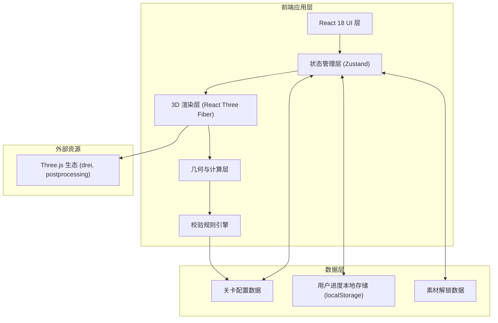
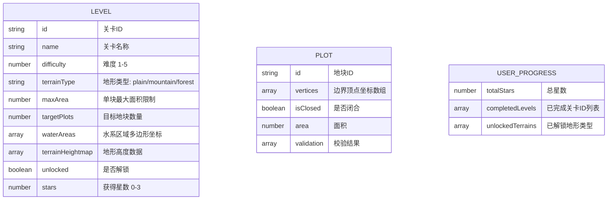

## 1. 架构设计



## 2. 技术描述

- **前端框架**：React 18 + TypeScript + Vite
- **样式方案**：Tailwind CSS 3
- **3D 渲染**：three.js + @react-three/fiber + @react-three/drei + @react-three/postprocessing
- **状态管理**：Zustand（轻量级状态管理，适合游戏场景）
- **几何计算**：Turf.js（地理空间计算、面积、多边形关系判断）
- **本地存储**：localStorage 存储用户进度和解锁状态
- **后端**：无（纯前端应用，校验规则内置在前端引擎中）

## 3. 路由定义

| 路由 | 用途 |
|------|------|
| `/` | 关卡选择界面 |
| `/level/:levelId` | 3D 测绘主场景 |

## 4. 数据模型

### 4.1 数据模型定义



### 4.2 TypeScript 类型定义

```typescript
interface Vertex {
  x: number;
  y: number;
  z: number;
}

interface WaterArea {
  id: string;
  polygon: Vertex[];
}

interface Level {
  id: string;
  name: string;
  difficulty: number;
  terrainType: 'plain' | 'mountain' | 'forest';
  maxArea: number;
  targetPlots: number;
  waterAreas: WaterArea[];
  heightmapData: number[][];
  size: { width: number; depth: number };
}

interface Plot {
  id: string;
  vertices: Vertex[];
  isClosed: boolean;
  area: number;
  validation: {
    closed: boolean;
    areaValid: boolean;
    noWaterCrossing: boolean;
    noOverlap: boolean;
  };
}

interface ValidationResult {
  valid: boolean;
  errors: string[];
  warnings: string[];
}

interface UserProgress {
  completedLevels: Record<string, { stars: number; completed: boolean }>;
  unlockedTerrains: string[];
  totalStars: number;
}
```

## 5. 核心模块说明

### 5.1 地形生成模块
- 使用 PlaneGeometry + 顶点位移程序化生成地形
- 根据关卡配置的 heightmap 数据调整高度
- 不同地形类型使用不同纹理和颜色渐变

### 5.2 边界绘制模块
- Raycaster 实现点击地形获取三维坐标
- 顶点拖拽使用 DragControls 或自定义射线拾取
- 边界线使用 LineSegments + TubeGeometry 实现立体效果

### 5.3 校验引擎模块
- 闭合校验：首尾顶点距离判断
- 面积计算：使用 Turf.js 的 polygon + area 方法
- 水系穿越：线段与多边形相交检测（Turf.js lineIntersect）
- 边界重叠：多边形相交检测（Turf.js intersect）

### 5.4 3D 交互控制
- OrbitControls 实现视角旋转/缩放/平移
- 限制俯仰角度避免穿模
- 双击重置视角
